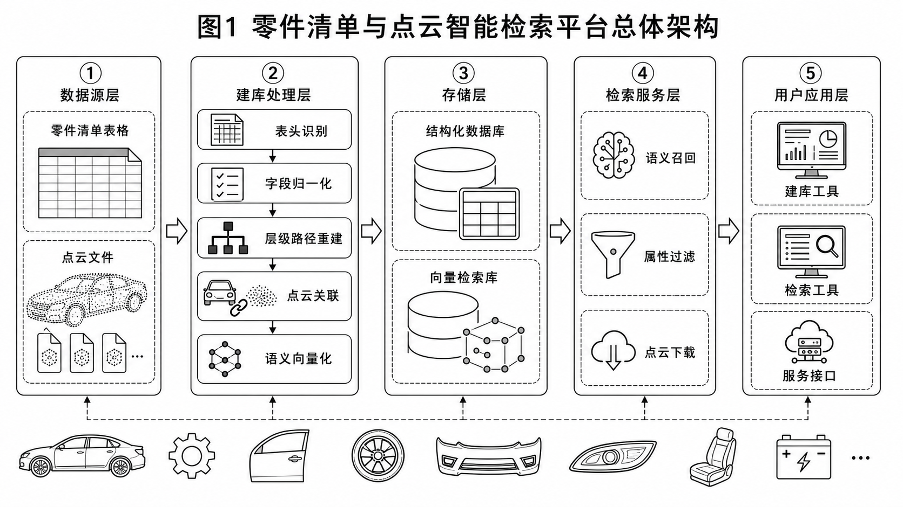
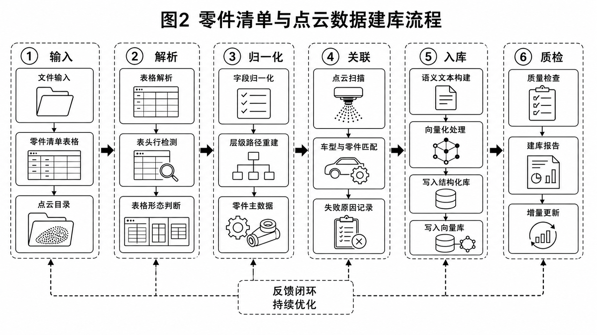
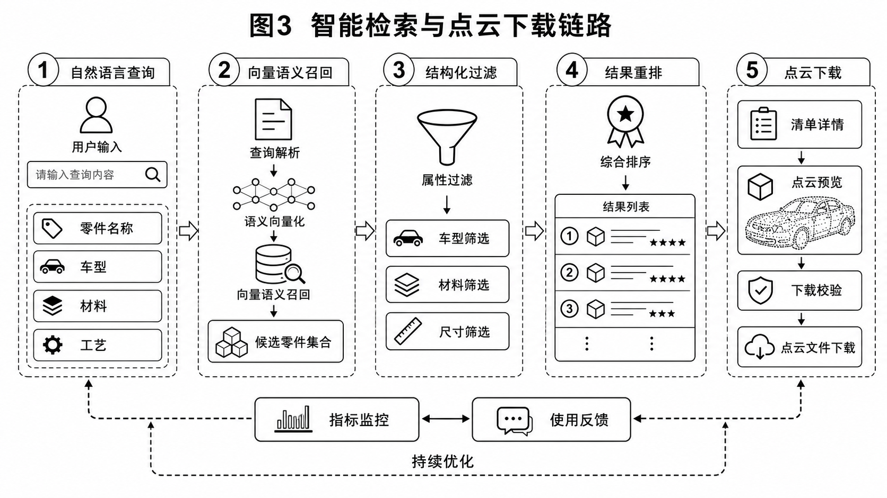

# 车辆竞品平台BOM与点云智能检索技术文档

本文档面向公司内部研发、竞品平台开发、数据维护及业务应用团队，说明一套基于公司车辆竞品平台现有 BOM 表数据和点云数据建设的智能检索技术产品。平台开发者使用建库工具和服务接口完成数据库建设与网页端集成，最终用户在竞品网页端直接检索零部件、车型、材料、工艺和对应三维数据。

从产品定位看，本项目不是单独面向个人使用的离线检索脚本，而是竞品平台后台能力的一部分。建库工具解决“数据如何稳定进入平台后台”的问题，服务接口解决“网页端如何调用检索和下载能力”的问题，网页端则承接业务用户的日常检索、对标分析和点云资料获取。三者形成后台建库、服务供给、前台使用的闭环。

## 1 项目介绍

### 1.1 项目背景

公司车辆竞品平台沉淀了大量车型拆解资料，其中 BOM 表承担零部件清单、层级关系、材料、工艺、尺寸、重量等结构化信息，点云文件承担零部件三维形态和逆向分析入口。实际使用中，两类数据往往来自不同批次和不同命名习惯：同一字段可能出现中文、英文、缩写或人工备注；同一零件在文件夹、表格行和点云文件名中的描述也不完全一致。

传统查询方式依赖人工打开表格、筛选字段、进入目录查找点云，再根据经验判断文件与零件是否对应。该方式不利于跨车型对标、材料工艺复用分析和新人使用。随着数据规模增长，查找成本已成为影响竞品分析效率的重要因素。

更深层的问题在于，BOM 表和点云文件虽然都描述同一批竞品零部件，但缺少稳定的统一索引。BOM 的优势是结构化字段完整，适合做车型、材料、零件号、工艺、重量和尺寸过滤；点云的优势是贴近三维形态，适合做逆向设计、空间校核和结构对比。如果两类数据不能关联，工程师往往只能先在表格里找到零件，再到目录里人工猜测文件；如果关联关系可以被平台化沉淀，检索结果就能同时给出零件属性和点云入口。

#### 1.1.1 业务需求

业务侧需要将分散的 BOM 表和点云文件转化为可检索、可解释、可下载的数据资产。最终用户希望在竞品网页端通过“前保险杠外板”“铝合金副车架”“某车型座椅骨架点云”等描述获得候选零件，并按车型、材料、工艺、尺寸、层级路径等属性收敛结果。平台开发者和数据维护人员则需要稳定的建库工具与服务接口，支持全量建库、自动监控、增量更新、失败记录、质量检查和网页端集成。

报告中的数据规模与效果指标不编造真实数值，统一采用“待补充”口径。后续补充车型数量、BOM 行数、点云文件量、点云关联数量、建库耗时和 Top-K 命中率等指标。

因此，业务需求可以拆为三类。第一类是数据治理需求，需要把历史 BOM 中不一致的表头、层级列、合并单元格和人工备注转成统一字段。第二类是检索体验需求，需要让最终用户既能输入自然语言，也能使用车型、材料、工艺等精确条件过滤。第三类是平台集成需求，需要让竞品平台开发者通过稳定的 HTTP 接口调用检索、字段枚举和下载能力，而不必在网页端直接感知 DuckDB、Qdrant 或 Embedding 服务细节。

#### 1.1.2 核心目标

项目核心目标包括四点。第一，统一解析历史 BOM 表，完成表头识别、字段归一化和层级路径重建。第二，扫描并关联点云文件，使三维文件挂接到对应零件记录。第三，基于 BGE-M3 建立零部件语义向量，配合 DuckDB 和 Qdrant 形成“语义召回+结构化过滤”的检索链路。第四，提供 Windows 图形化建库工具和 HTTP 服务接口，支撑数据库维护、自动增量更新和网页端检索下载集成。

目标达成后，系统应具备三个可验收特征：一是建库结果可追溯，每条记录能回到来源文件、来源行和原始字段；二是检索结果可解释，用户能看到命中零件的名称、层级、属性和相似度来源，而不是只看到黑箱排序；三是交付形态可集成，平台开发者可以在后台定期维护数据库，并在网页端复用统一服务接口。

## 2 实现方式

### 2.1 数据集构建

建库流程以 BOM 表和点云目录为输入。系统读取常见表格文件，检测有效表头行，过滤空行、说明行和无效列。字段归一化模块结合列名映射规则，把“零件名称”“Part Name”“名称”等表述归并到统一字段，把“材料”“材质”“Material”等归并到材料字段，并识别车型、厂家、零件号、工艺、尺寸、重量、系统位置等业务字段。

系统兼容两类典型表格形态。形态 A 是多级层级列直接表达零部件树；形态 B 是存在明确零件名称列，同时层级信息分散在其他列。建库时会判断表格形态，修正合并单元格空值，重建层级路径，并生成层级数组、层级深度和规范零件名称。

点云建库采用目录扫描与候选匹配结合的方式。系统遍历点云根目录，提取文件名、车型目录、相对路径等信息，再与 BOM 行中的车型和零件名称匹配。匹配成功的点云写入对应零件行；未匹配到 BOM 的点云保留为仅点云记录，避免文件资产遗漏。建库过程输出失败原因和统计报告，便于修订源数据。

数据集构建的关键原则是“尽量保留原始信息，同时生成可检索的规范信息”。原始字段会进入原始数据列，便于后续审计和问题回溯；规范字段用于检索、过滤和展示，例如规范零件名称、层级路径、车型、材料、工艺、尺寸和点云路径。对于暂时无法归一化的字段，系统不直接丢弃，而是保留在原始数据中，避免历史资料在清洗过程中丢失。

增量建库依赖文件变化识别和失败记录复用。平台开发者或数据维护人员可以将 BOM 文件夹和点云根目录作为持续维护的数据源，工具监控新增、删除或变更文件后，只对变化部分重新解析、向量化和写库。这样可以减少重复计算，并让竞品平台后台数据库随源数据变化保持更新。失败报告则帮助维护人员定位问题，例如某个 BOM 缺少有效表头、某些点云文件名无法与零件名称建立候选关系、某些路径超出允许的数据根目录等。

### 2.2 模型选择

本项目的语义检索对象不是通用网页文本，而是零部件短文本、层级路径、车型描述、材料工艺描述和中英混合字段。模型选型重点关注中文语义理解、短文本召回质量、中英混合表达、部署成熟度、向量维度与向量库适配、内网服务可用性以及工程稳定性。

候选 Embedding 模型可按业务适配性进行对比：

| 候选模型 | 主要特点 | 对 BOM 与点云检索的适配性 | 主要风险或限制 | 选型结论 |
| --- | --- | --- | --- | --- |
| BGE-M3 | 支持中文和多语言语义表达，适合短文本、句子和较长上下文的统一向量化；本项目使用 1024 维向量接入 Qdrant 余弦检索。 | 适合处理中英混合零件名、层级路径、系统位置和工程简称，能在“语义召回+结构化过滤”架构中承担主要召回能力。 | 仍需结合内部竞品数据集验证 Top-K 命中率；对零件号、尺寸、重量等精确字段不能替代结构化过滤。 | 推荐作为默认模型。 |
| BGE-large-zh 类中文向量模型 | 中文语义能力较强，工程资料和中文零件名称适配度较好。 | 适合中文 BOM 字段占主导的场景，可作为纯中文检索基线模型。 | 对中英混合、英文缩写和跨语言零件描述的覆盖不如多语言模型稳妥；多粒度文本适配需另行测试。 | 可作为对照模型。 |
| M3E / text2vec 类中文通用模型 | 部署简单，中文通用语义检索实践较多，资源消耗相对可控。 | 可覆盖常见中文零件名称、材料和工艺术语，适合做轻量化验证。 | 面向复杂层级路径、工程简称和中英混合文本时可能需要更多同义词规则补充。 | 可作为轻量备选。 |
| multilingual-E5 类多语言模型 | 多语言检索能力较强，适合跨语言查询和英文资料占比较高的场景。 | 对英文零件名、供应商英文描述、中文查询与英文字段混合检索有参考价值。 | 需要验证中文工程语境下的细粒度零件区分能力；与现有内部服务和向量维度配置的适配成本需评估。 | 可作为跨语言备选。 |
| 传统关键词/BM25 方案 | 不依赖 Embedding，结果可解释，适合精确词匹配。 | 对零件号、明确名称、材料等字段检索有效，可用于辅助召回或兜底。 | 对别名、简称、语义相近描述和自然语言查询支持不足，难以单独满足网页端智能检索体验。 | 适合作为辅助方案，不作为主模型。 |

综合评估后，项目选择 BGE-M3 作为默认 Embedding 模型。第一，BGE-M3 对中文和中英混合文本有较好的语义表达能力，适合处理“前舱横梁”“front bumper beam”“铝合金压铸件”等混合输入。第二，BOM 零件文本粒度差异较大，有的只有零件名称，有的包含层级路径、系统位置和工艺描述，BGE-M3 对多粒度文本表达较为友好。第三，项目使用 1024 维向量，并与向量检索库的余弦距离模式匹配。第四，模型已有较成熟的工程部署实践，适合通过内部 AI 服务统一调用。第五，BGE-M3 与 Qdrant 的写入、召回和排序逻辑稳定。

选择 BGE-M3 还考虑了业务文本的“别名”和“上下文”问题。竞品零部件名称经常存在简称、工程叫法和供应链叫法，例如“前保”“前保险杠总成”“前保险杠外板”可能出现在不同资料中；同一零件还可能因为所属系统不同而产生不同业务含义。单纯关键字检索要求用户输入与 BOM 完全一致的词，而向量检索可以利用语义相近关系召回候选，再由结构化字段做精确收敛。BGE-M3 在该场景中承担的是语义归一化能力，而不是替代材料、尺寸、车型等确定性过滤条件。

模型选型不以公开榜单指标直接作为业务结论，也不在本文中编造命中率。实际验收应在公司内部竞品数据集上完成，包括高频零件查询、同义词查询、中英混合查询、材料工艺组合查询和带点云意图的查询。只有在同一测试集、同一 Top-K 口径、同一服务环境下对比，才能判断模型是否真正适合本项目。

### 2.3 检索架构与服务链路

#### 2.3.1 双库协同架构

系统采用“语义召回、结构化过滤、结果可追溯”的总体架构。建库阶段将 BOM 与点云整理为统一零件记录，分别写入 DuckDB 结构化库和 Qdrant 向量库；检索阶段先进行语义召回，再基于结构化字段过滤，最终返回 BOM 详情、层级路径和点云下载入口。该架构将零件语义与车型、材料、尺寸等精确条件分开处理，既保留语义检索的灵活性，也避免所有判断都落在向量相似度上。

双库架构的分工比较明确。DuckDB 负责保存可审计、可过滤、可展示的结构化数据，包括来源文件、来源行、零件名称、零件号、车型、厂家、材料、工艺、尺寸、重量、层级数组、点云路径和原始字段。Qdrant 负责保存零件记录的向量表达，并使用余弦相似度完成 Top-K 候选召回。两者通过统一记录编号关联，避免向量库承载过多复杂业务字段，也避免结构化库承担高维向量近邻搜索压力。

#### 2.3.2 向量化文本构建

向量化文本构建不是简单把整行 BOM 拼接起来。若把所有字段无差别写入语义文本，车型、编号、尺寸、重量等精确值会干扰零件语义；若只保留零件名称，又会丢失层级上下文，导致“支架”“盖板”“梁”等泛化名称召回不稳定。因此系统重点保留零件本体、辅助名称、零件类型、层级路径、系统位置、部位描述和方向描述，把更适合精确判断的字段留给结构化过滤。

建库阶段，每条零件记录生成一段稳定的 Embedding 文本，经 BGE-M3 转换为 1024 维向量后写入 Qdrant。查询阶段，用户输入的自然语言也经同一模型向量化，并与库内零件向量计算相似度。该策略能兼顾召回泛化能力和结果可控性，也便于后续通过样本集调整字段拼接策略。

语义相似度公式如下：

$$
\operatorname{sim}(q,d)=\frac{\mathbf{e}_q\cdot \mathbf{e}_d}{\|\mathbf{e}_q\|_2\|\mathbf{e}_d\|_2}
$$

其中，$\mathbf{e}_q$ 表示查询文本向量，$\mathbf{e}_d$ 表示零件记录向量。相似度越高，说明查询与零件语义越接近。

#### 2.3.3 召回过滤与结果组织

检索链路采用“先宽召回、再精过滤”的方式。系统从 Qdrant 获得候选零件编号后，回到 DuckDB 执行车型、来源文件、零件名称、材料、工艺、系统位置、尺寸、重量、层级包含等过滤条件。自然语言查询可进一步解析出车型、材料、工艺等条件，用于把用户的一句话转成语义召回和属性约束的组合。

结果组织层将候选零件、结构化字段、层级路径、相似度分数和点云路径转换为网页端可展示的数据结构。最终结果按综合分数排序，展示 BOM 详情、来源行、层级上下文、点云预览入口和下载状态。对最终用户而言，结果列表应突出零件名称、车型、材料、工艺、所属系统和是否存在点云；对平台维护人员而言，结果详情应保留来源文件、来源行、原始字段和匹配状态，便于发现表格解析或点云关联问题。对于仅点云记录，系统应明确标识其缺少 BOM 属性，避免用户误认为数据完整。

#### 2.3.4 服务接口与网页端集成

服务接口面向竞品平台开发者提供后台能力，而不是要求最终用户直接使用本地检索端。字段枚举接口为前端筛选器提供车型、材料、工艺等可选项；检索接口接收查询词、Top-K、分页和过滤参数；自然语言检索接口尝试从一句话中提取结构化约束；下载接口根据检索结果中的点云标识返回受控文件。这样设计可以让竞品平台前端专注交互体验，后台服务统一处理检索语义、数据过滤和文件边界。

这种架构适合竞品平台的网页端集成。网页端发起查询后，服务接口先将用户输入向量化，向量库返回候选编号，结构化库再补全字段并执行过滤，最后服务接口返回可直接渲染的结果对象。平台开发者可以在网页端展示零件卡片、属性筛选器、层级路径、来源信息和点云下载按钮，而不需要在前端实现复杂的召回和排序逻辑。点云下载路径在服务端校验，确保文件访问限定在配置的数据根目录内。

### 2.4 效果评估与持续优化

效果评估分为建库质量、检索效果、系统性能和业务价值四类。建议统计车型数量、BOM 行数、点云文件量、成功关联点云数量、仅点云记录数量、建库耗时和向量写入耗时，当前统一以“待补充”表示。

评估口径应分阶段进行。建库阶段重点看字段识别覆盖率、层级路径重建正确率、点云匹配率和失败原因分布；检索阶段重点看 Top-K 命中率、错召回类型、过滤后结果数量和用户点击/下载行为；服务阶段重点看平均响应耗时、超时率、接口错误率和下载路径拦截情况。业务价值则需要结合工程师实际使用反馈评估，例如一次竞品对标任务中减少多少人工查找环节。

字段识别覆盖率用于衡量表头和字段归一化效果：

$$
C_{field}=\frac{N_{recognized\_cols}}{N_{total\_cols}}\times100\%
$$

点云匹配率用于衡量点云与 BOM 的关联效果：

$$
R_{pc}=\frac{N_{linked\_pointcloud\_files}}{N_{total\_pointcloud\_files}}\times100\%
$$

检索效果采用 Top-K 命中率、响应耗时和候选过滤通过率：

$$
Hit@K=\frac{1}{N}\sum_{i=1}^{N}\mathbb{I}(y_i\in TopK_i)
$$

$$
T_{avg}=\frac{1}{N}\sum_{i=1}^{N}t_i,\quad
P_{filter}=\frac{N_{after\_filter}}{N_{before\_filter}}\times100\%
$$

#### 2.4.1 检索效果优化

后续改进建议采用可审计的灰度方式推进。第一，扩充人工标注查询集，覆盖高频零件、别名、材料工艺组合和点云下载场景。第二，对 BGE-M3 与其他候选向量模型进行同口径对比，只比较内部数据集上的命中率、错召回类型和响应耗时。第三，优化 Embedding 文本构建策略，区分零件本体语义、层级语义和过滤字段。

后续优化不建议只追求更大的模型或更复杂的召回链路。更可控的方向是先把业务样本集建设好，把“用户输入、期望零件、可接受候选、错误原因”记录下来，再针对性优化字段拼接、同义词归一、召回数量和排序规则。对于工程场景，稳定可解释通常比单次样例效果更重要，尤其是在网页端面向多角色用户开放后，错误召回和错误下载都会影响平台信任度。

#### 2.4.2 验收指标与测试口径

当前测试结果以待补充口径表达，不编造真实数值。建议验收项包括：车型数量、BOM 行数、点云文件量、建库总耗时、字段识别覆盖率、点云匹配率、检索平均耗时、Top-5/Top-10 命中率、人工修正问题数。业务收益可从竞品拆解知识沉淀、跨车型零部件对标、材料工艺分析和点云资产定位四方面评估。

建议测试集按业务任务组织，而不是只按随机关键词组织。例如，材料对标类查询关注“铝合金”“高强钢”“注塑件”等条件与零件语义的组合；结构对标类查询关注“副车架”“门槛梁”“座椅骨架”等跨车型召回；点云下载类查询关注检索结果是否能正确给出文件入口；数据维护类测试关注新增 BOM 和新增点云后是否能被增量建库捕获。每类任务都应保留人工判定结果，形成后续版本对比基线。

## 3 产品化部署与展望

产品交付形态区分开发使用端和业务使用端。建库工具和服务接口主要提供给竞品平台开发者、平台运维人员和数据维护人员：建库工具提供 Windows 图形化界面，用于选择 BOM 文件夹、点云根目录和输出目录，执行全量建库、自动监控和增量更新，并查看进度、失败报告和统计信息；服务接口提供健康检查、字段枚举、语义检索、自然语言检索和点云下载能力，供开发者接入竞品网页端。最终用户不直接接触底层数据库、向量库或建库配置，而是在竞品网页端基于后台已建数据库完成检索、筛选、详情查看和点云下载。

增量建库是产品化的重要能力。系统识别新增或变更的 BOM 文件与点云文件，只处理变化部分，降低重复向量化和写库成本。对于失败数据，建库工具保留原因，如表头无法识别、必填字段缺失、点云路径不可达、点云与零件无法匹配等。服务接口面向网页端封装下载能力，点云下载限定在已配置的数据根目录内，返回下载链接前完成路径校验，保证最终用户只能通过竞品平台授权链路访问对应文件。

后续可从四个方向演进。第一，扩展多模态数据，把图片、拆解照片、检测报告、PDF、CAD 元数据纳入统一检索。第二，引入权限审计，按车型、项目、文件来源控制访问范围。第三，建立人工反馈闭环，用点击、下载和纠错结果优化召回策略。第四，将服务能力平台化，支撑工程知识问答、相似零件推荐和竞品对标分析。

部署时建议采用“后台建库、服务常驻、网页调用”的方式。建库工具由平台侧在受控机器上运行，生成 DuckDB 文件和 Qdrant 向量集合；检索服务在平台后台常驻，对外只暴露必要 HTTP 接口；网页端根据用户权限调用检索和下载能力。对于点云文件，服务端需要继续保留路径白名单校验，避免前端传入任意路径造成越权访问。对于后续平台化，可增加任务调度、建库日志归档、服务健康告警和版本回滚能力，使该能力从项目工具逐步演进为竞品数据中台的基础组件。
